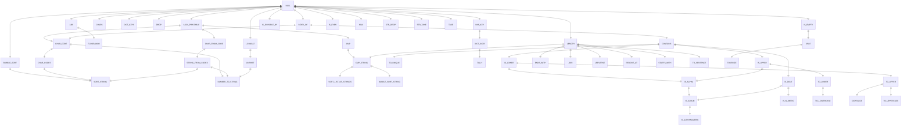

# Exercism Bootcamp Custom Functions (stdlib)

Dependency relationships:

```mermaid
erDiagram
    NULL ||--|| ABS : ""
    NULL ||--|| ASCII_PRINTABLE : ""
    NULL ||--|| BUBBLE_SORT : ""
    NULL ||--|| CHARS : ""
    NULL ||--|| DICT_KEYS : ""
    NULL ||--|| DROP : ""
    NULL ||--|| HAS_KEY : ""
    NULL ||--|| INDEX_OF : ""
    NULL ||--|| IS_DIVISIBLE_BY : ""
    NULL ||--|| IS_EMPTY : ""
    NULL ||--|| IS_EVEN : ""
    NULL ||--|| LCONCAT : ""
    NULL ||--|| LENGTH : ""
    NULL ||--|| MAX : ""
    NULL ||--|| STR_DROP : ""
    NULL ||--|| STR_TAKE : ""
    NULL ||--|| TAKE : ""
    ABS ||--|| FLOOR_MOD : ""
    ASCII_PRINTABLE ||--|| CHAR_CODE : ""
    ASCII_PRINTABLE ||--|| CHAR_FROM_CODE : ""
    ASCII_PRINTABLE ||--|| CMP : ""
    BUBBLE_SORT ||--|| SORT_STRING : ""
    CHAR_CODE ||--|| CHAR_CODES : ""
    CHAR_CODE ||--|| NUMBER_TO_STRING : ""
    CHAR_CODES ||--|| SORT_STRING : ""
    CHAR_FROM_CODE ||--|| STRING_FROM_CODES : ""
    CMP ||--|| CMP_STRING : ""
    CMP_STRING ||--|| SORT_LIST_OF_STRINGS : ""
    CMP_STRING ||--|| BUBBLE_SORT_STRING : ""
    CONTAINS ||--|| IS_LOWER : ""
    CONTAINS ||--|| IS_UPPER : ""
    CONTAINS ||--|| IS_DIGIT : ""
    CONTAINS ||--|| TO_UNIQUE : ""
    DICT_INCR ||--|| TALLY : ""
    HAS_KEY ||--|| DICT_INCR : ""
    INDEX_OF ||--|| CHAR_CODE : ""
    INDEX_OF ||--|| CONTAINS : ""
    IS_ALNUM ||--|| IS_ALPHANUMERIC : ""
    IS_ALPHA ||--|| IS_ALNUM : ""
    IS_DIGIT ||--|| IS_ALNUM : ""
    IS_DIGIT ||--|| IS_NUMERIC : ""
    IS_EMPTY ||--|| SPLIT : ""
    IS_LOWER ||--|| IS_ALPHA : ""
    IS_LOWER ||--|| TO_UPPER : ""
    IS_UPPER ||--|| IS_ALPHA : ""
    IS_UPPER ||--|| TO_LOWER : ""
    LCONCAT ||--|| UNSHIFT : ""
    LENGTH ||--|| ENDS_WITH : ""
    LENGTH ||--|| JOIN : ""
    LENGTH ||--|| LREVERSE : ""
    LENGTH ||--|| REMOVE_AT : ""
    LENGTH ||--|| STARTS_WITH : ""
    LENGTH ||--|| TO_SENTENCE : ""
    LENGTH ||--|| CMP_STRING : ""
    SPLIT ||--|| TOKENIZE : ""
    STRING_FROM_CODES ||--|| NUMBER_TO_STRING : ""
    STRING_FROM_CODES ||--|| SORT_STRING : ""
    TO_LOWER ||--|| TO_LOWERCASE : ""
    TO_UPPER ||--|| CAPITALIZE : ""
    TO_UPPER ||--|| TO_UPPERCASE : ""
    UNSHIFT ||--|| NUMBER_TO_STRING : ""
```
